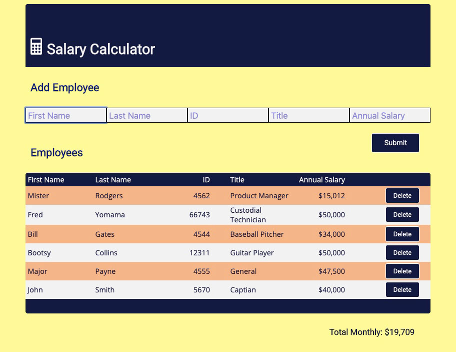

# jQuery Salary Calculator

## Description

Duration: *2-day sprint*

The project was to create a salary calculator. The given requirements were 
* create and update a table
* take user input
* allow for the deletion of employees
* display the monthly payroll cost

This site builds an array of employee objects. Meeting the requirement of having user input from the web page and also allowing for future scripting of larger employee payroll files.  The monthly payroll cost updates using the reduce method on the employee array - summing all employees salaries.

The css styling presents a clean input and data display. The color theme works to keep the user engaged and make the information stand out.  When monthly payroll exceeds $20,000 the user is alerted with red and white styling on the monthly payroll total.

The input boxes check the user's input and will go to the box that needs filling-in.  There is a submit button but the enter key works as well as this is more natural when entering large numbers of employees.  The display of new rows is animated to make the interface more visually appealing.

To see the fully functional site, visit: [DEPLOYED VERSION OF APP](https://pensive-wescoff-31c39c.netlify.com/ "Salary Calculator hosted on Netlify")

## Screenshot

## Installation
Fork and clone repository. Open index.html

## Usage
1. Install  (*see above*)
2. Type employee information into fields. Tab to next
3. Add to the table by pressing enter or clicking 'Submit'
4. Delete employees by clicking 'Delete' button

## Acknowledgement
Thanks to [Prime Digital Academy](www.primeacademy.io) in Minneapolis and the Scytale Cohort of Full-Stack Developers.

